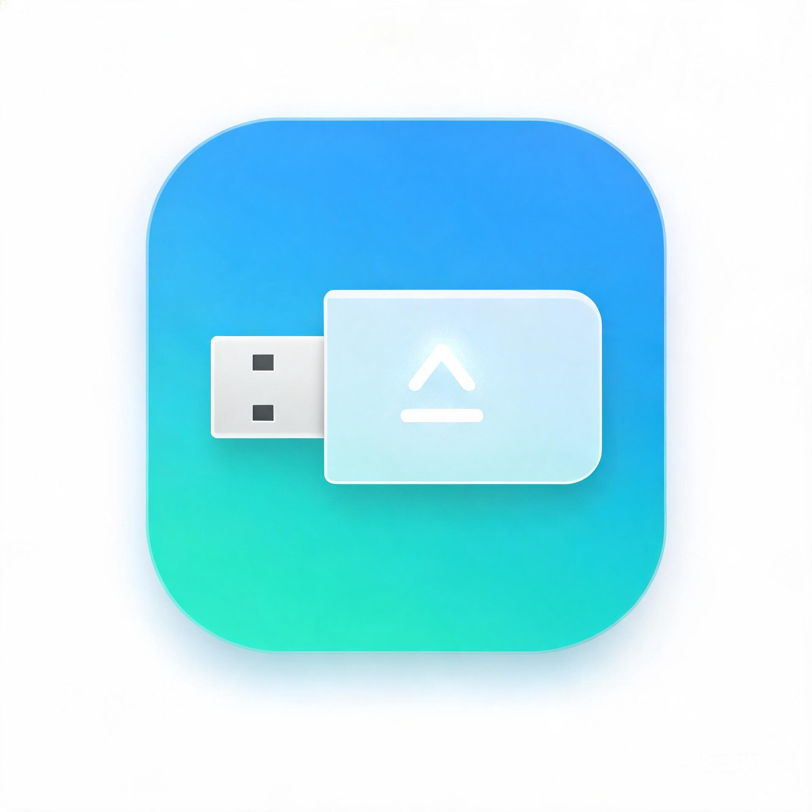

# USBDriveMgr

<p align="center">
  
</p>
USB 设备管理器：一个轻量级的 Windows 桌面工具，用于分析 USB 存储设备的占用进程并安全弹出。当系统提示"该设备正在使用中"时，它可以帮你找出占用设备的进程，终止后完成安全弹出，避免直接拔盘导致的数据损坏。

## 功能特性

- **USB 设备识别**：自动枚举所有 USB 总线类型的可移动磁盘
- **占用分析**：三重检测机制合并去重，全面找出占用目标盘符的进程
- **进程管理**：查看占用进程的 PID 与完整路径，支持多选、全选、批量终止
- **安全弹出**：先检查占用并提示用户确认，终止进程后尝试弹出设备
- **系统托盘**：最小化到托盘，托盘右键菜单可直接弹出任意 USB 设备，支持气泡通知
- **自动刷新**：定时器每 2 秒刷新设备列表，插拔 U 盘自动感知

## 界面

```
┌─────────────────────────────────────────────────────────────────┐
│ 选择USB驱动器: [E: (MyDisk) ▼] [分析占用] [全选] [终止选中] [安全退出]  │
├─────────────────────────────────────────────────────────────────┤
│ PID 1234 - C:\...\example.exe                                   │
│ PID 5678 - D:\...\tool.exe                                      │
│ ...                                                             │
└─────────────────────────────────────────────────────────────────┘
```

- 点击 **分析占用**：列出占用所选盘符的所有进程
- 点击 **终止选中**：终止列表中勾选的进程（有确认对话框）
- 点击 **安全退出**：一键完成"检查占用 → 询问终止 → 弹出设备"完整流程
- 关闭窗口时隐藏到托盘，托盘图标双击恢复，右键菜单可弹出设备或退出

## 构建

1. 用 Visual Studio 2022 打开 `USBDriveMgr.slnx`
2. 选择 `Release` / `x64` 配置
3. 生成解决方案，输出位于 `x64\Release\USBDriveMgr.exe`

> 提示：终止受保护的系统进程可能需要管理员权限运行。

## 核心实现说明

**占用检测** 同时使用三种方式检测并合并去重：

1. **Restart Manager**：Windows 官方推荐方式，安装器用来检测文件占用的同一套 API
2. **句柄扫描**：通过 `ntdll!NtQuerySystemInformation`（class 64）拿到全系统句柄表，复制句柄后用 `GetFinalPathNameByHandleW` 还原文件路径并匹配盘符，可捕获 RM 检测不到的占用
3. **工作目录扫描**：遍历所有进程，读取 PEB → `ProcessParameters` → `CurrentDirectory`，捕获"工作目录在 U 盘上"这类隐性占用（如资源管理器、终端）

**弹出策略（`SafeEject` / `EjectDrive`）**：

- 检测到占用时弹窗列出进程，用户确认后终止并等待 500ms 让系统释放句柄
- 先对卷设备执行 `IOCTL_STORAGE_EJECT_MEDIA` 弹出媒体
- 失败则通过 SetupAPI 定位磁盘设备实例，调用 `CM_Request_Device_EjectW` 弹出设备；若被否决，逐级向上请求父设备（最多 5 层），覆盖 U 盘多分区等场景

## 许可证

本项目使用 **MIT 许可证**，详情见 [LICENSE](LICENSE) 文件
